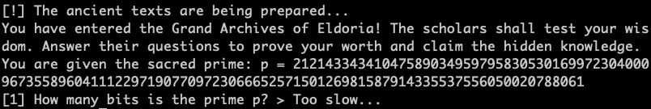
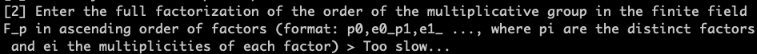

# 🔐 Crypto Challenge

## 🏷️ Name: Kewiri

## 🔥 Difficulty: Very Easy

## 🎯 Points: 1000

## 📜 Challenge Description: 
> The Grand Scholars of Eldoria have prepared a series of trials, each testing the depth of your understanding of the ancient mathematical arts. Those who answer wisely shall be granted insight, while the unworthy shall be cast into the void of ignorance. Will you rise to the challenge, or will your mind falter under the weight of forgotten knowledge?<br><b>The instance might take 1-2 minutes to start.</b>

# 🚀 Methodology

The questions for this challenge were easy, but the timeout made it so hard to properly write a script that solves it and gets the next questions. Most of the questions use the same parameters, so we can compute them in advance.


### 🔎 1️⃣ How many bits is the prime p?:



We are given prime

 ```
 p = 21214334341047589034959795830530169972304000967355896041112297190770972306665257150126981587914335537556050020788061
 ```

It's quite easy to get the bit length:

```python

p = 21214334341047589034959795830530169972304000967355896041112297190770972306665257150126981587914335537556050020788061
answer_1 = p.bit_length() #384
```

To get to the next qu

### ⚔️ 2️⃣ The full factorization of the order of the multiplicative group in F_p:



The order of the multiplicative group in the finite field F_p is `p-1`. We can use sage to find the factors. What was more annoying was the formatting. 

```python

p = 21214334341047589034959795830530169972304000967355896041112297190770972306665257150126981587914335537556050020788061
factors = factor(p-1)

def format_factors(factors):
    flattend = flatten(list(factors))
    answer = [str(flattend[0])]
    middle = flattend[1:-1]
    for i in range(0,len(middle),2):
        pair = middle[i:i+2]
        answer.append(f'{pair[0]}_{pair[1]}')
    answer.append(str(flattend[-1]))
    result =  ','.join(answer)
    return result

answer = format_factors(factors)
print(answer)
#2,2_5,1_635599,1_2533393,1_4122411947,1_175521834973,1_206740999513,1_1994957217983,1_215264178543783483824207,1_10254137552818335844980930258636403,1
```

### ⚡ 3️⃣  For this question, you will have to send 1 if the element is a generator of the finite field F_p, otherwise 0:

What was difficult was figuring out how many times we needed to answer this question. To find whether a number is a generator we can do the following:


```python
def is_generator(g, p,factors):
    for q, _ in factors:
        if pow(g, (p - 1)//q, p) == 1:
            return 0
    return 1

```

In the end, there were 17 elements that we needed to check.


### 🔨 4️⃣ What is the order of the curve defined over F_p ?

At this point we receive the following text:

>The scholars present a sacred mathematical construct, a curve used to protect the most guarded secrets of the realm. Only those who understand its nature may proceed.

```
a = 408179155510362278173926919850986501979230710105776636663982077437889191180248733396157541580929479690947601351140
b =  8133402404274856939573884604662224089841681915139687661374894548183248327840533912259514444213329514848143976390134
```

We can construct the curve in SageMath and get its order:

```python

E = EllipticCurve(GF(p),[a,b])
order = E.order()
print(order)
#21214334341047589034959795830530169972304000967355896041112297190770972306665257150126981587914335537556050020788061
```

Interesting, the order of the curve is the same as $p$, this means it's an anomalous curve; and the discrete log is fairly easy to compute with Smart's attack.

### 🔑 5️⃣ The full factorization of the order of the elliptic curve defined over the finite field F_{p^3}

The question is : "Enter the full factorization of the order of the elliptic curve defined over the finite field F_{p^3}. Follow the same format as in question 2"

```python

F_P3.<z> = GF(p^3)
E3 = EllipticCurve(F_P3,[a,b])

E3_order = E3.order()
assert E3_order%p ==0 
partial_order = E3_order//p #otherwise it will take forever in sage


factors = list(factor(partial_order))
factors.append((p,1))
factors = sorted(factors,key=lambda x: x[0])

answer = format_factors(factors)
print(answer)
#2,2_7,2_21214334341047589034959795830530169972304000967355896041112297190770972306665257150126981587914335537556050020788061,1_2296163171090566549378609985715193912396821929882292947886890025295122370435191839352044293887595879123562797851002485690372901374381417938210071827839043175382685244226599901222328480132064138736290361668527861560801378793266019,1
```

### 🔨 6️⃣ What is the value of d?

Here we have to compute the Discrete Log of point G to point A. First, it's important to notice that G is always the same. 

The **full question is**: The final trial awaits. You must uncover the hidden multiplier "d" such that A = d * G. 

`⚔️ The chosen base point G has x-coordinate: 10754634945965100597587232538382698551598951191077578676469959354625325250805353921972302088503050119092675418338771`

`🔮 The resulting point A has x-coordinate: #some coordinate`


```python

G = E.lift_x(10754634945965100597587232538382698551598951191077578676469959354625325250805353921972302088503050119092675418338771)
A = E.lift_x(11764468489436065047310461128858888413163270857497356475772548210690105858441127172177990254214737885054024257966883)

discrete_log(G,A,operation='+') #TOO LONG; can't use
A.padic_elliptic_logarithm(G,p) #Also TOO  long; can't use

```
SageMath's implementation for calculating discrete log is too long, so we can try with Smart's Attack directly.

This function is from this [writeup](https://ctftime.org/writeup/38441).

```python

def SmartAttack(P,Q,p):
    E = P.curve()
    Eqp = EllipticCurve(Qp(p, 2), [ ZZ(t) + randint(0,p)*p for t in E.a_invariants() ])

    P_Qps = Eqp.lift_x(ZZ(P.xy()[0]), all=True)
    for P_Qp in P_Qps:
        if GF(p)(P_Qp.xy()[1]) == P.xy()[1]:
            break

    Q_Qps = Eqp.lift_x(ZZ(Q.xy()[0]), all=True)
    for Q_Qp in Q_Qps:
        if GF(p)(Q_Qp.xy()[1]) == Q.xy()[1]:
            break

    p_times_P = p*P_Qp
    p_times_Q = p*Q_Qp

    x_P,y_P = p_times_P.xy()
    x_Q,y_Q = p_times_Q.xy()

    phi_P = -(x_P/y_P)
    phi_Q = -(x_Q/y_Q)
    k = phi_Q/phi_P
    return ZZ(k)

d = SmartAttack(G,A,p)
print(d)
```


**🚩 Final Flag:** `HTB{Welcome_to_CA_2k25!Here_is_your_anomalous_flag_for_this_challenge_and_good_luck_with_the_rest:)_061fdcc8ecef131d8d5d8d341178f37b}`

