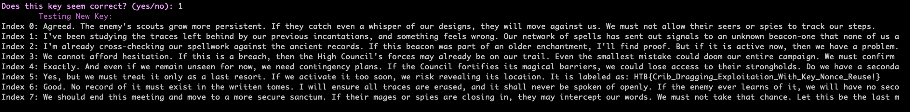

# 🔐 Crypto Challenge

## 🏷️ Name: Traces

## 🔥 Difficulty: Very Easy

## 📜 Challenge Description: 
> Long ago, a sacred message was sealed away, its meaning obscured by the overlapping echoes of its own magic. The careless work of an enchanter has left behind a flaw—a weakness hidden within repetition. With keen eyes and sharper wits, can you untangle the whispers of the past and restore the lost words?

## 📂 Provided Files:
- **Filename:** `crypto_traces.zip`

# 🚀 Methodology

### 🔎 1️⃣ Understanding the Cryptosystem

This is a **mini IRC-like server** called `MiniIRCServer` that allows users to interact with simulated IRC channels. All messages exchanged in channels are **encrypted using AES in CTR (Counter) mode** with a **random 256-bit key (`os.urandom(32)`)** generated on server startup.

- Each message is encrypted using:
  ```python
  AES.new(self.key, AES.MODE_CTR, counter=Counter.new(128))
  ```
- Encrypted messages are printed to the screen in **hex format**.
- The `encrypt()` and `decrypt()` methods use the **same function**, relying on the symmetric nature of CTR mode.
- The tool simulates IRC commands like `JOIN`, `LIST`, `NAMES`, and handles private/public channels.

The server allows us to:
- list channel names
- list members of channels
- join a channel

Joining a channel will give us access to the encrypted messages.

There are two channels:
- `#general`
- `#secret`

To access the secret channel, we need to provide a key. It's highly likey that the key is somehwere in the #general channel. 

Members of the `#general` include:

- `Doomfang`
- `Stormbane`
- `Runeblight`


### ⚡ 2️⃣ Identifying Vulnerabilities

The system encrypts all messages using:

```python
AES.new(self.key, AES.MODE_CTR, counter=Counter.new(128))
```

🚨 The **Problem**:

- The `Counter.new(128)` is **static** — it's the same every time.
- No random nonce or IV is used.
- This means the **same keystream** is used for **every encryption**.

AES in CTR mode turns AES into a stream cipher:

```
ciphertext = plaintext XOR keystream
```

If the **keystream is reused**, then:

```
ciphertext1 XOR ciphertext2 = plaintext1 XOR plaintext2
```

This allows a classic **crib-dragging attack**:
- If an attacker knows or can guess part of one plaintext
- They can recover parts of other plaintexts


### 🔨 3️⃣ Exploiting the Weakness

There was a code I wrote using ntlk words for another CTF, which I revived and refined for this challenge.

Essentially, it uses NLTK's English word corpus to match partial plaintexts and suggesst possible completions. It's **NOT** refined or polished.
And it's really annoying when it comes to special characters (which was a problem for this challenge). 

The crib dragger xors the guessed plaintexts with the ciphertexts and asks us to **validate** the output. 

It worked to decrypt both channels. 


### 🔑 4️⃣ Recovering the Flag

The first step is to gather the encrypted messages from the `#general` channel.
We know that channels begin with:
- '!nick {username}'

The longest username is **Runeblight**, so we can start with that to derive a partial keystream.
From then one, it's all interactive.


Once we recover the private key for the `#secret` channel, we need to repeat the approach.



The code I used for Crib Dragging is [here](https://github.com/forensicskween/CribDragger). 


**🚩 Final Flag:** `HTB{Crib_Dragging_Exploitation_With_Key_Nonce_Reuse!}`

