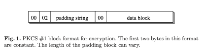
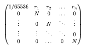

# 🔐 Crypto Challenge

  

## 🏷️ Name: Verilicious

  

## 🔥 Difficulty: Medium

  

## 🎯 Points: 1000

  

## 📜 Challenge Description:

> A sacred ward, once thought unbreakable, is built upon a foundation of misplaced trust. The ancient order that devised it never foresaw the cracks in their own defenses. A true cipher-weaver, one with a deep understanding of hidden structures, may find a way to tear it down. Can you?

  

## 📂 Provided Files:

-  **Filename:**  `crypto_verilicious.zip`

  

-  **SHA-256 Hash:**  `f0ba0a57a4db6fa0ffe7507196fe8dcd78b1896b3f2b81afadb41f87a56a0532`

  

# 🚀 Methodology

### 🔎 1️⃣ Understanding the Cryptosystem

We are given three files:

- output.txt 
- pubkey.pem 
- source.py


Digging into the source file, we can see the following:

```python

class Verilicious:
    def __init__(self):
        self.key = RSA.import_key(open('privkey.pem', 'rb').read())
        self.cipher = PKCS1_v1_5.new(self.key, randbytes)

    def verify(self, c):
        c = b'\x00'*(self.key.n.bit_length()//8-len(c)) + c
        return int(self.cipher.decrypt(c, sen := get_random_bytes(self.key.n.bit_length()//8)) != sen)

    def encrypt(self, m):
        return self.cipher.encrypt(m)
    

orac = Verilicious()
enc_flag = orac.encrypt(open('flag.txt', 'rb').read()).hex()
assert all(orac.verify(l2b(pow(r, orac.key.e, orac.key.n) * int(enc_flag, 16) % orac.key.n)) for r in R)

```

The last assertion reveals to us that the R values satisfy the conditions for Bleichenbacher's 1998 attack. 

---

### Bleichenbacher 1998 Attack (B98)

The Bleichenbacher 1998 attack is a padding oracle attack against RSA encryption using PKCS#1 v1.5. It allows an attacker to decrypt ciphertexts by exploiting a server (oracle) that reveals whether the decrypted plaintext has correct padding.

The original paper defines a **PKCS#1 v1.5 block** like this:

<span style="display:block;text-align:center"></span>

The attacker can submit arbitrary ciphertexts $c'$ to the oracle, which returns whether the decrypted message $m' = c'^d \bmod n$ has valid PKCS#1 v1.5 padding.<br>


<br>

Let the original ciphertext be $c$ and suppose the attacker computes:

$$c' = (r^e \cdot c) \bmod n$$

and submits $c'$ to the oracle. If the oracle returns **"valid"**, this means that:

$$m' = (r^e \cdot c)^d \bmod n = (r \cdot m) \bmod n$$ 

has **valid** padding. 


Thus, **a valid** $r$ reveals that $r \cdot m \bmod n$ lies within the set of integers corresponding to correctly padded messages. Since PKCS#1 v1.5 padding forces the plaintext to start with bytes like `0x00 0x02`, this tells us that:

$$r \cdot m \bmod n \in [2B, 3B)$$ 

where $B = 2^{8(k - 2)}$ and $k$ is the RSA modulus length in bytes.


<br>

Now this works when we have an **active** oracle, the attack because it lets us test chosen ciphertexts, allowing us to iteratively narrow the plaintext into **high/low intervals** based on padding validity. We can't do that since it's a **static** challenge.


**References**

Bleichenbacher, D. (1998). [Chosen Ciphertext Attacks Against Protocols Based on the RSA Encryption Standard](https://crypto.stanford.edu/~dabo/pubs/papers/b01bleichenbacher.pdf). *Advances in Cryptology — CRYPTO ’98*, Lecture Notes in Computer Science, vol 1462. Springer.


---


### ⚡ 2️⃣ Identifying Vulnerabilities

I searched and searched and searched for ways to implement this attack statically 🫠. I knew it was a problem that could be solved via a lattice attack and LLL, but I wanted to understand the math behind it and know how to properly construct the lattice. 

Eventually, I found (and I actually knew) this amazing [repository](https://github.com/josephsurin/lattice-based-cryptanalysis) which I highly recommend for different challenges or if you're trying to explore cryptographic attacks.  

The code for the **B98 attack** uses the hidden number problem. However, it requires some modification to work with our challenge, it computes the R values in the following way:

```python 

l = N.nbits()
ell = int(1.3 * l / 16)

while len(R) < ell: 
    #...

```

In our case **ell** is 83; but we have 78 values. Anyways, I saw that the repository references:

- P. Q. Nguyen. *Public-Key Cryptanalysis.* In Recent Trends in Cryptography. Ed. by I. Luengo. Vol. 477. AMS-RSME, 2009. https://www.di.ens.fr/~pnguyen/PubSantanderNotes.pdf

for its **B98 attack**. 

### Nguyen 2009 Attack (B98)

The attack/reasoning is described in section **7.2. High-Dimensional Attack**. 

Further expanding on **B98** , the paper explains the following:

- We only know an approximation of each $(r_i \cdot m) \bmod n$
- It states that, 'more precisely, if we let $a = 2^{l - 15}$, where $l$ is the bit-length of N, then it represents the number 0002 shifted to the left $0 \leq (r_i \cdot m \bmod N) - a < \frac{N}{2^{16}}$'
- It further tells us that we have a **better approximation** if we use $a' = a + \frac{N}{2^{17}}$, which I think is where/why the code from the repository didn't work originally. 

Finally, it establishes the relation:

$$| (r_i \cdot m \bmod N) - a' | \leq \frac{N}{2^{17}}$$


Which, Nguyen asserts this is a hidden number problem, where $m$ is the 'hidden number'. 

Hence, we can solve the HNP as a lattice closest vector problem. Thankfully, the paper explains how we should construct the lattice:


<span style="display:block;text-align:center"></span>

Per the paper, if we multiply the first row by $m$ and subtract the multiples of the other rows, the lattice $L$ contains the vector 

$$m = ( \frac{m}{65536},\ m r_1 \bmod N,\ \ldots,\ m r_n \bmod N )$$

Therefore if we define our target vector $t$ as 

$$t = ( \frac{N}{2^17},\ a', a' ,\ \ldots, a' )$$

then the vector $m$ is very close to vector $t$. 

The paper used BKZ reduction and Babai's nearest plane algorithm to solve for vector $m$. However, BKZ reduction is very costly in terms of time. 


### 🔨 3️⃣ Exploiting the Weakness

Implementing the paper's attack in SageMath:

First of all, we define $a$ and $a'$, and then create our target vector $t$:


```python 

N = key.n

k = N.bit_length() #1024

a = 2**(k-15)
a_prime = a + N // 2^17

target = [N/(2**17)] + [a_prime]*len(R)

t = vector(QQ,target) #the vector t as defined in the paper

```

Then, we create our lattice and reduce it with LLL:

```python 

M = N*identity_matrix(QQ,len(R)+1)

r = vector(QQ,[1/(65536)] + R) #first row of the lattice

M[0] = r

M_Reduced = M.LLL()

```

Finally, we implement Babai's Closest Vector Problem, the code for this is from [here](https://github.com/josephsurin/lattice-based-cryptanalysis/blob/5b0541dcfd475d1f3838c568618198b5f6367368/lbc_toolkit/common/babai_cvp.sage)

```python 

M_Gram_Schmidt = M_Reduced.gram_schmidt()

G = M_Gram_Schmidt[0]

b = t
for i in reversed(range(M_Reduced.nrows())):
    c = ((b * G[i]) / (G[i] * G[i])).round()
    b -= c * M_Reduced[i]

m = t - b # the vector m as defined in the paper
message_0 = m[0]*65536
print(l2b(int(message_0)))

```

We can also check that all the values in the vector m pass the PKCS1 verification, based on PyCryptodome's code:

```python 

def pkcs1_decode(msg: int, sentinel: bytes = b"") -> bytes:
    
    encoded_msg =b'\x00' + l2b(int(msg))
    # Must be at least 11 bytes: 0x00 0x02 <padding> 0x00 <data>
    if len(encoded_msg) < 11:
        return sentinel

    # Check padding format
    if encoded_msg[0] != 0x00 or encoded_msg[1] != 0x02:
        return sentinel

    # Padding must be non-zero and at least 8 bytes
    try:
        # Padding ends at first 0x00 after byte 2
        sep_idx = encoded_msg.index(b'\x00', 2)
    except ValueError:
        return sentinel

    if sep_idx < 10:
        return sentinel  # Padding too short (<8 bytes)

    return encoded_msg[sep_idx + 1:]

m_recovered = [m[0]*65536] + list(m)[1:]
assert all([pkcs1_decode(x,bytes(16))!=bytes(16) for x in m_recovered])
```

Which is **valid**, so we successfully recovered the full vector $m$. 


We can also do the following:

```python 

m_0 = int(m_recovered[0])

for m_r,r in zip(m_recovered[1:],R):
    c_m = (pow(r,key.e,key.n)*enc_flag) % key.n
    m_r_ = pow(m_0*r,key.e,key.n)
    assert m_r_ == c_m == pow(int(m_r),key.e,key.n)

```

Again, it is **valid!**. 

### 🔑 4️⃣ Recovering the Flag

To get the flag, we simply need to unpad m_0. 

```python 

m_padded = l2b(m_0)
flag = m_padded.split(b'\x00')[1]
print(flag.decode())

```

**🚩 Final Flag:** `HTB{Bleichenbacher_Lattice_Attack_and_The_Hidden_Number_Problem___Cool_Right?!}`

