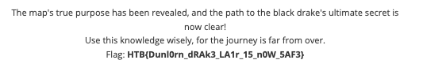

# 🕵️ Forensics Challenge

## 🏷️ Name: Cave Expedition

## 🔥 Difficulty: Medium

## 🎯 Points: 975

## 📜 Challenge Description: 
> Rumors of a black drake terrorizing the fields of Dunlorn have spread far and wide. The village has offered a hefty bounty for its defeat. Sir Alaric and Thorin answered the call also returning with treasures from its lair. Among the retrieved items they found a map. Unfortunately it cannot be used directly because a custom encryption algorithm was probably used. Luckily it was possible to retrieve the original code that managed the encryption process. Can you investigate about what happened and retrieve the map content?


## 📂 Provided Files:
- **Filename:** `forensics_cave_expedition.zip`

---

# 🚀 Methodology

## 🔎 1️⃣ Initial Investigation

We are given two files:
- `map.pdf.secured`: This is clearly the encrypted file.
- `Logs.zip`: Contains Windows event logs.

To begin, I used an existing tool I had developed to convert Windows event logs into an SQLite database, allowing for easier timeline analysis:

```bash
python3 evtx2db.py -i Logs -o output -e
```

This parsed 389 records, mainly from the Sysmon Operational channel, which conveniently includes `CommandLine` arguments. To extract relevant information, I used the following script:

```python

import sqlite3
import pandas as pd
import json

conn = sqlite3.connect('output/timeline.db')
df = pd.read_sql("SELECT * FROM Timeline;",conn)
conn.close()

df['EventData'] = df['EventData'].apply(lambda x: json.loads(x) if x else x)
df['CommandLine'] = df['EventData'].apply(lambda x: x.get('CommandLine') if x else x)

for cmd in df[df['CommandLine'].notna()]['CommandLine']:
    print(cmd)

```

From the output, we can reconstruct the attacker’s activity:

1. Event logs were cleared using:
   ```
   "C:\Windows\system32\wevtutil.exe" cl event_log_channel
   ```
2. A batch script was executed:
   ```
   C:\Windows\system32\cmd.exe /c ""C:\Users\developer56546756\Desktop\avAFGrw41.bat""
   ```
3. A PowerShell command wrote base64 data to a file:
   ```
   powershell -c "'SOME_BASE64_STRING' | Out-File -Encoding ascii -FilePath b -Append -NoNewline"
   ```
4. The encoded script was decoded using certutil:
   ```
   certutil -decode b avAFGrw41.ps1
   ```
5. The decoded script was then executed:
   ```
   powershell.exe -ExecutionPolicy Bypass -File avAFGrw41.ps1
   ```
6. Event logs were exported:
   ```
   wevtutil.exe epl event_log_channel
   ```

---


## 🔢 2️⃣ Analyzing the PowerShell Script

To reconstruct `avAFGrw41.ps1`, I extracted and decoded the base64-encoded content:

```python
import base64

powershell_code = ''
for cmd in df[df['CommandLine'].notna()]['CommandLine']:
    if cmd.startswith('powershell  -c "'):
        powershell_code += cmd.split("'")[1]

decoded_code = base64.b64decode(powershell_code).decode()
with open('avAFGrw41.ps1', 'w') as of:
    of.write(decoded_code)
```

I then deobfuscated the [code](avAFGrw41_deobfuscated.ps1).

Basically, the encryption mechanism is a "Triple" xor encryption, where the contents of the file are xored with two keys. I translated the script's logic into Python for analysis:

```python
import base64
from pwn import xor

Var1 = "Ki50eHQgKi5kb2MgKi5kb2N4ICoucGRm"
Var2 = "..."
Var3 = "NXhzR09iakhRaVBBR2R6TGdCRWVJOHUwWVNKcTc2RWl5dWY4d0FSUzdxYnRQNG50UVk1MHlIOGR6S1plQ0FzWg=="
Var4 = "n2mmXaWy5pL4kpNWr7bcgEKxMeUx50MJ"

def Base64DecodeVar2():
    return base64.b64decode(Var2).decode()

def Decode_And_Split_Var1():
    return base64.b64decode(Var1).decode().split(' ')

def Base64DecodeString(input_string):
    return base64.b64decode(input_string)

def XOR_TripleBuffer(inputBytes,key1,key2):
    return xor(inputBytes,key1,key2)

def xor_triple(input_bytes, key1, key2):
    result = bytearray()
    for i in range(len(input_bytes)):
        b = input_bytes[i] ^ key1[i % len(key1)] ^ key2[i % len(key2)]
        result.append(b)
    return bytes(result)


decoded_key1 = Base64DecodeString(Var3)
decoded_key2 = Base64DecodeString(Var4)

map_encrypted = open('map.pdf.secured','rb').read()
map_decoded = Base64DecodeString(map_encrypted.decode('utf-8'))

map_decrypted = xor_triple(map_decoded,decoded_key1,decoded_key2)

```

ANDDDD IT'S WRONG. So, I tried to debug it a few times, and eventually I ran this code on [TryItOnline](https://tio.run/#powershell) to check if it was a python-specific problem. 


```powershell
$a53Va = "NXhzR09iakhRaVBBR2R6TGdCRWVJOHUwWVNKcTc2RWl5dWY4d0FSUzdxYnRQNG50UVk1MHlIOGR6S1plQ0FzWg=="
$b64Vb = "n2mmXaWy5pL4kpNWr7bcgEKxMeUx50MJ"


function a12Vc {
    param([string]$a34Vd)
    return [Text.Encoding]::UTF8.GetString([Convert]::FromBase64String($a34Vd))
}


function BytesToHex {
    param([string]$str)
    $bytes = [System.Text.Encoding]::UTF8.GetBytes($str)
    return ($bytes | ForEach-Object { $_.ToString("x2") }) -join ""
}

$c56Ve = a12Vc $a53Va
$d78Vf = a12Vc $b64Vb

$HexKey1 = BytesToHex $c56Ve
$HexKey2 = BytesToHex $d78Vf

Write-Host "DecodedKey1 (Hex): $HexKey1"
Write-Host "DecodedKey2 (Hex): $HexKey2"
```

which gave me:

`DecodedKey1 (Hex): 357873474f626a485169504147647a4c674245654938753059534a713736456979756638774152533771627450346e7451593530794838647a4b5a654341735a`

`DecodedKey2 (Hex): efbfbd69efbfbd5defbfbdefbfbdefbfbdefbfbdefbfbdefbfbd56efbfbdefbfbddc8042efbfbd31efbfbd31efbfbd4309`


Now, starting over in python:

```python

key1 = bytes.fromhex('357873474f626a485169504147647a4c674245654938753059534a713736456979756638774152533771627450346e7451593530794838647a4b5a654341735a')

key2 = bytes.fromhex('efbfbd69efbfbd5defbfbdefbfbdefbfbdefbfbdefbfbdefbfbd56efbfbdefbfbddc8042efbfbd31efbfbd31efbfbd4309')


map_decrypted = xor_triple(map_decoded,key1,key2)
assert map_decrypted[:4] == b'%PDF'

with open('map.pdf','wb') as of:
    of.write(map_decrypted)

```

and we get the flag! 



## 🎯 Final Flag

```
HTB{Dunl0rn_dRAk3_LA1r_15_n0W_5AF3}
```

---