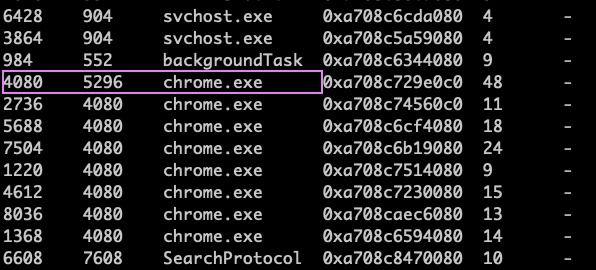
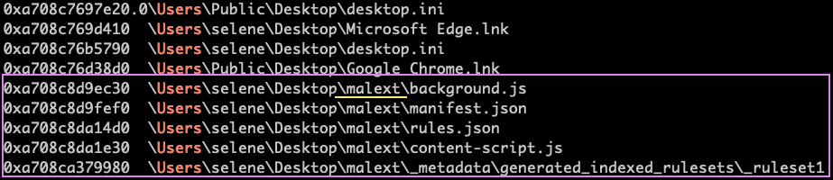
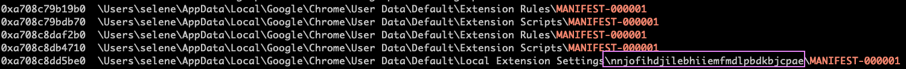
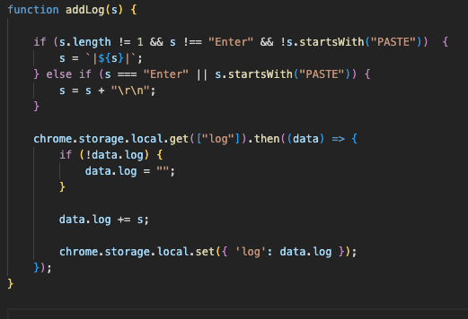
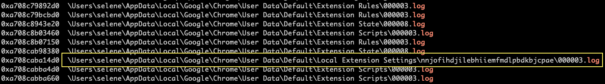
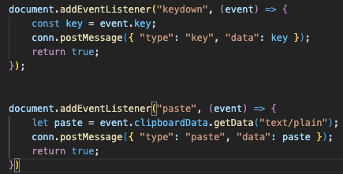
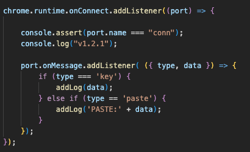
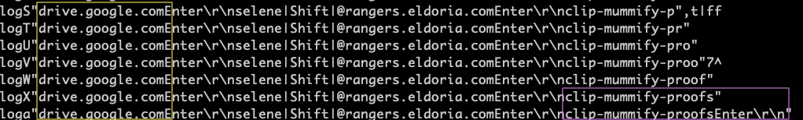

# 🕵️ Forensics Challenge

## 🏷️ Name: Stealth Invasion

## 🔥 Difficulty: Easy

## 📜 Challenge Description: 
> Selene's normally secure laptop recently fell victim to a covert attack. Unbeknownst to her, a malicious Chrome extension was stealthily installed, masquerading as a useful productivity tool. Alarmed by unusual network activity, Selene is now racing against time to trace the intrusion, remove the malicious software, and bolster her digital defenses before more damage is done.

--- 
## 📂 Provided Files:
- **Filename:** `memdump.elf`

--- 

# 🚀 Methodology

First things first, I don't know if this only happened to me, but I had to create a virtual environment and install the *develop* branch of **volatility3**. 

### 🔎 1️⃣ Understanding the Evidence

We have a Windows 10 Memory Dump, which based on the filename could've been interpreted as a Linux dump at first. 


#### 📋 Task 1: What is the PID of the Original (First) Google Chrome process:

To check the running processes:

```bash

vol -f memdump.elf windows.pslist

```



**✅ Answer:** `4080`


#### 📋 Task 2: What is the only Folder on the Desktop:

We can list the files with the FileScan plugin. I usually save the output to a file, in case I need to find the offsets later. 

```bash

vol -f memdump.elf windows.filescan.FileScan > filescan.txt
cat filescan.txt | grep -F '\Users\' | grep Desktop 

```



**✅ Answer:** `malext`


#### 📋 Task 3: What is the Extention's ID (ex: hlkenndednhfkekhgcdicdfddnkalmdm)

Now, we need to dump the files with DumpFiles plugin. 

```bash
cat filescan.txt | grep -F 'Desktop\malext\' | sed 's/\\.*//g' | tr ' \n ' ' '
```

This will give the addresses delimited with commas

Now we're ready to dump! 

```bash
mkdir malext && cd malext 

$vol -f ../memdump.elf windows.dumpfiles --virtaddr 0xa708c8d9ec30 0xa708c8d9fef0 0xa708c8da14d0 0xa708c8da1e30 0xa708ca379980

```

and for clarity, I renamed the files:

```bash
for f in *DataSectionObject.*.dat; do
  newname=$(echo "$f" | sed -E 's/.*DataSectionObject\.//' | sed 's/\.dat$//')
  mv -- "$f" "$newname"
done
```

But that's not what we need to find the Extension's id. 

```bash
cat filescan.txt | grep 'Extension' | grep Chrome | grep MANIFEST-000001
```




**✅ Answer:** `nnjofihdjilebhiiemfmdlpbdkbjcpae`

#### 📋 Task 4: After examining the malicious extention's code, what is the log filename in which the datais stored:

Opening the file `background.js`, we can see that it accesses the `chrome.storage.local` log. 




We can find its filename by checking the filescan output:

```bash
cat filescan.txt | grep AppData | grep Chrome | grep Extension | grep log
```

There's one log file that matches the Extension's ID:



**✅ Answer:** `000003.log`

#### 📋 Task 5: What is the URL the user navigated to

Based on the contents of the JavaScript files, we can deduce that the extension is a KeyLogger:

`content-script.js`:





`background.js`:




And clearly, it must be saved in the specific log file. 


```bash
cat filescan.txt | grep 'nnjofihdjilebhiiemfmdlpbdkbjcpae' | grep '000003.log'

vol -f memdump.elf windows.dumpfiles --virtaddr 0xa708caba14d0
mv *DataSectionObject* log_file.bin
strings log_file.bin
```




**✅ Answer:** `drive.google.com`

#### 📋 Task 6: What is the password of selene@rangers.eldoria.com

Based on the previous output, it's clip-mummify-proofs.


**✅ Answer:** `clip-mummify-proofs`

