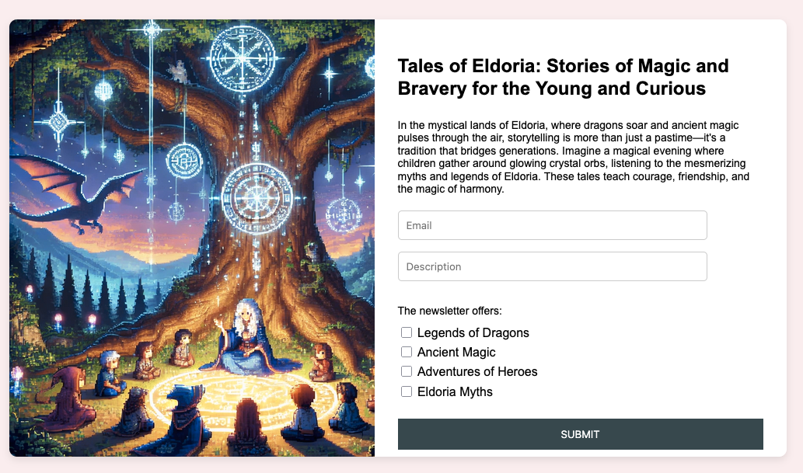
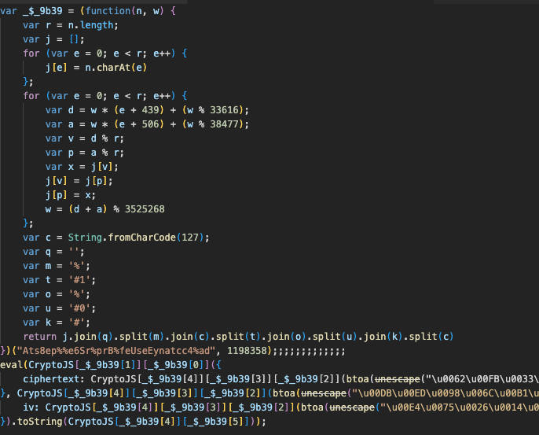
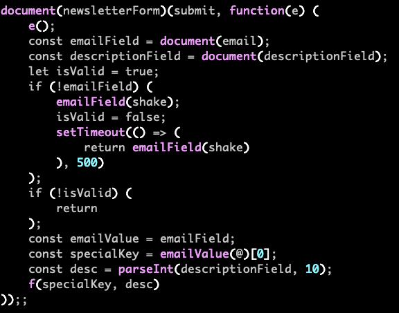
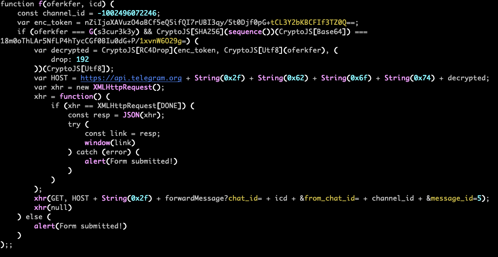
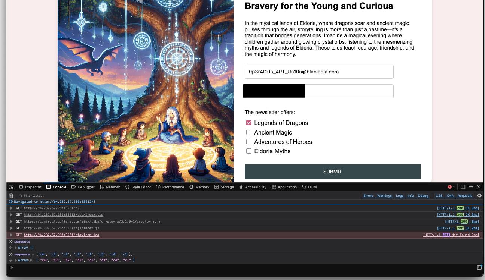
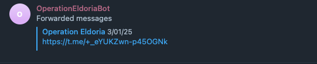
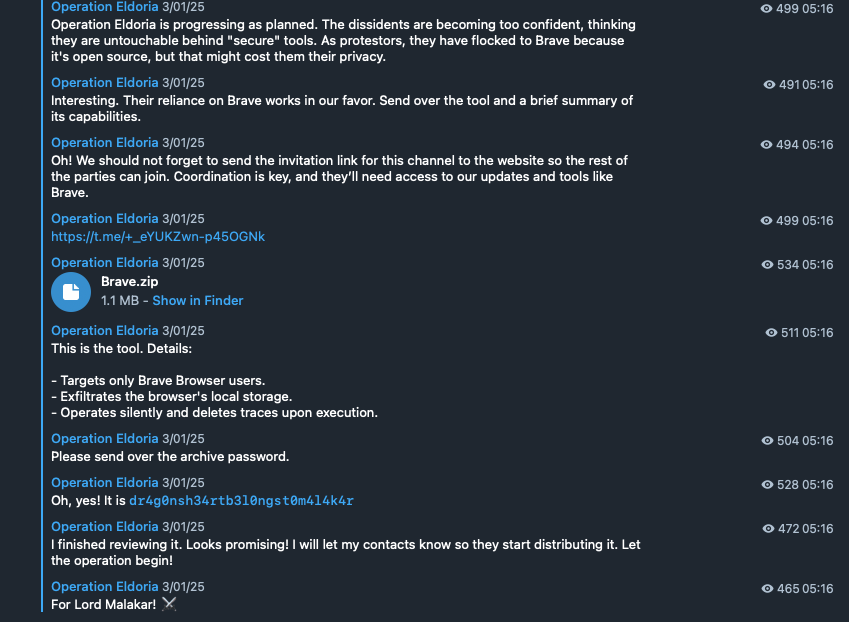
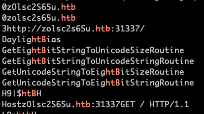
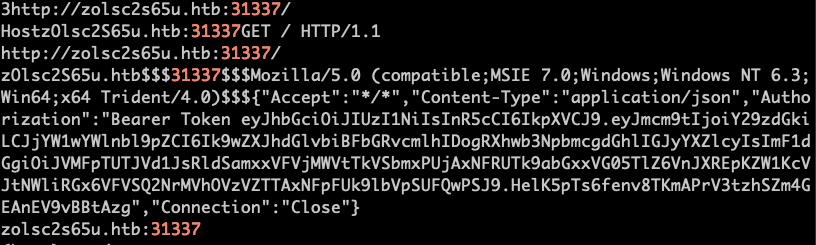

# 🕵️ Forensics Challenge

## 🏷️ Name: Tales for the Brave

## 🔥 Difficulty: Hard

## 📜 Challenge Description: 
>  In Eldoria, a once-innocent website called “Tales for the Brave” has become the focus of unsettling rumors. Some claim it may secretly trap unsuspecting visitors, leading them into a complex phishing scheme. Investigators report signs of encrypted communications and stealthy data collection beneath its friendly exterior. You must uncover the truth, and protect Eldoria from a growing threat. <br><b> **When debugging JavaScript, ensure you use a Firefox-based browser.**</b>

# 🚀 Methodology

This was the only hard challenge of the CTF 😞, but it was so much fun!!!
We started without any downloadable files, just access to a Docker-hosted webpage.


## 🔎 1️⃣ Initial Investigation: The Website

Initially, I accessed the provided Docker instance and landed on a seemingly ordinary website:



Upon inspecting the source code via Developer Tools, I found obfuscated JavaScript (`index.js`):




### ⚙️ 2️⃣ Decoding JavaScript (Stage 1)


The JS was using CryptoJS AES decryption on a long encoded string, looking like this:


```javascript
eval(CryptoJS['AES']['decrypt']((
    ciphertext: CryptoJS['enc']['Base64']['parse'](btoa(unescape(SOME_VERY_LONG_STRING)))
), CryptoJS['enc']['Base64']['parse'](2+2YbLGJoUeV8oqzF69MLbIHNynPVLyT), (
    iv: CryptoJS['enc']['Base64']['parse'](5HUmFMpKNy84CfzGDQkwig==)
)).toString(CryptoJS['enc']['Utf8']))
```

I reconstructed this behavior/logic in Python:

```python
import base64
from Crypto.Cipher import AES
from Crypto.Util.Padding import unpad

def decrypt_string():
    KEY = base64.b64decode(S2)
    IV = base64.b64decode(S3)
    CT = base64.b64decode(S1)
    cipher = AES.new(KEY,AES.MODE_CBC,IV)
    DEC = cipher.decrypt(CT)
    return unpad(DEC,16).decode()

STAGE2 = decrypt_string()
print(STAGE2)
#var _$_8b18 = (function (k, j) { var y = k.length; [...]
```

The output was another obfuscated JavaScript code, which I beautified using the `jsbeautifier` library:

```python
import jsbeautifier
with open("../stage_2/Stage2.js", 'w') as of:
    of.write(jsbeautifier.beautify(STAGE2))
```

*This is the full [code](files/stage_1/stage_1.py) for this stage.*


### 🔍 3️⃣ Analyzing Stage 2 JavaScript

The beautified Stage 2 code contained critical functions that dynamically interacted with the webpage and validated user input.

#### 📌 1. The Document Submission Function

This function:
- Extracts the username part of the email (before `@`)
- Assigns it to `specialKey`
- Validates that the Description is an integer (used later as a Telegram user ID)
- Then calls function `f()` with both values




#### 📌 2. Function `f`



Function `f()` does the following:

1. Checks the email username against a computed string from `G()`
2. Validates a user-input `sequence` by comparing its SHA256 hash against a hardcoded base64 hash
3. Decrypts an RC4Drop token to get a Telegram bot token

*The `sequence` is the order in which the checkboxes are checked.*

It then interacts with Telegram's API to forward us a message. 


#### 📌 3. Function G()

```python
def G():
    part1 = decode1(43, 106, 167, 103, 163, 98)  # char decoding
    part2 = to_base36(1354343).lower()
    part3 = ''.join(chr(ord(c) - 13) for c in to_base36(21).lower())
    part4 = to_base36(4).lower()
    part5 = ''.join(chr(ord(c) - 39) for c in to_base36(32).lower())
    part6 = ''.join(chr(ord(c) - 13) for c in to_base36(381).lower())
    part7 = decode2(42, 216, 153, 153, 213, 187)
    return part1 + part2 + part3 + part4 + part5 + part6 + part7
```

Result:
```text
0p3r4t10n_4PT_Un10n
```

*This is the full [code](files/stage_2/stage_2.py) for this stage.*


#### 📌 3. Getting the Decrypted Token:

--- 
#### Option 1: Directly in the Browser Console


The **RC4Drop decryption code** (in JS):

*To make this work directly inside the browser, you need to edit the HTML and add this:*
```html
<script src="https://cdnjs.cloudflare.com/ajax/libs/crypto-js/4.1.1/crypto-js.min.js"></script>
<script src="https://cdnjs.cloudflare.com/ajax/libs/crypto-js/4.1.1/mode-rc4drop.min.js"></script>"
```

```javascript
var decrypted = CryptoJS.RC4Drop.decrypt(
    { ciphertext: CryptoJS.enc.Base64.parse(enc_token) },
    CryptoJS.enc.Utf8.parse("0p3r4t10n_4PT_Un10n"),
    { drop: 192 }
);
console.log(decrypted.toString(CryptoJS.enc.Utf8));
```

Output:
```text
7767830636:AAF5Fej3DZ44ZZQbMrkn8gf7dQdYb3eNxbc
```

This gives us a Telegram **bot token**.

We can then reconstruct the URL:

`https://api.telegram.org/bot7767830636:AAF5Fej3DZ44ZZQbMrkn8gf7dQdYb3eNxbc/forwardMessage?chat_id={your_telegram_id}&from_chat_id=-1002496072246&message_id=5`

and us cURL to get the forwarded message.


#### Option 2: Brute-forcing the sequence

The possible elements in the sequence are the checkbox ids: `[ "c1", "c2", "c3", "c4" ]`.


Since the `f` function checks against a SHA256 hash, we can brute force the correct permutation:


```python
import hashlib
from itertools import permutations
import base64

def hashit(sequence):
    sequence_str = ''.join(sequence)  # sequence is a list of strings
    sha256_hash = hashlib.sha256(sequence_str.encode()).digest()
    return sha256_hash

TARGET_HASH = base64.b64decode("18m0oThLAr5NfLP4hTycCGf0BIu0dG+P/1xvnW6O29g=")

found = False
TARGETS = [ "c1", "c2", "c3", "c4" ]*3
for i in range(2,len(TARGETS)):
    for perm in permutations(TARGETS,int(i)):
        if hashit(perm) == TARGET_HASH:
            print(f'Found Correct Sequence: {perm}')
            found = True
            break
    if found:
        break

#Found Correct Sequence: ('c4', 'c2', 'c2', 'c2', 'c1', 'c3', 'c4', 'c1')
```

If you were to use this approach, you would need to manually enter the following:

- `0p3r4t10n_4PT_Un10n@blablabla.com` as the email
- Your Telegram ID as the description

Then, open Developer Tools Console and define:

`sequence = ['c4', 'c2', 'c2', 'c2', 'c1', 'c3', 'c4', 'c1'];`



Upon submission, it will redirect you to:


and the forwarded message is nothing but an expired group invitation. 





### 🌐 4️⃣ Telegram API Dumping

Since the forwarded message was expired, it made sense to try different message ids to be forwarded. 

We enumerated other Telegram messages using the decrypted bot token and Telegram API:

```python
import requests
import json
import os

headers = {"User-Agent": "curl/7.81.0"}
enc_token = '...'
user_token = '...'
results = {}

for idx in range(15):
    r = requests.get(f'https://api.telegram.org/bot{enc_token}/forwardMessage?chat_id={user_token}&from_chat_id=-1002496072246&message_id={idx}', headers=headers)
    resp = r.json()
    if 'result' in resp:
        results[idx] = resp['result']

os.makedirs('../stage_3', exist_ok=True)
with open('../stage_3/chat.json', 'w') as of:
    json.dump(results, of)

```

Your Telegram DMs should fill with forwarded messages:



And there's some interesting stuff about a file:

>This is the tool. Details:
>- Targets only Brave Browser users.
>- Exfiltrates the browser's local storage.
>- Operates silently and deletes traces upon execution.

Password to extract: `dr4g0nsh34rtb3l0ngst0m4l4k4r`


### 🤖 5️⃣ Analyzing `brave.exe`

Static analysis didn't reveal much, it was virtually impossible for me to reverse engineer the executable. Instead, I ran this on a clean VM with Brave installed. I then used WinDbg to generate a memory dump, and checked the output of `strings`:





Then I found an HTB API Bearer token, when searching for the port:



If you're familiar with the HTB API, the Bearer Token is what authenticates you. 


## 🔍 Final Stage: JWT Decoding

```python
import jwt
TOKEN = '...'
decoded = jwt.decode(TOKEN, options={"verify_signature": False})
print(decoded)
```

Output:
```json
{
  "from": "costi",
  "campaign_id": "Operation Eldoria : Exposing the braves",
  "auth": "U0ZSQ2UwRlFWRjlqTUc1emNERnlOR014TTNOZllqTm9NVzVrWDJJemJqRm5ibDlzTURCck1XNW5YM014ZEROemZRPT0="
}
```

Decode `auth`:

```python
import base64
print(base64.b64decode(decoded['auth']).decode())
# HTB{APT_c0nsp1r4c13s_b3h1nd_b3n1gn_l00k1ng_s1t3s}
```


## 🏆 Flag

**HTB{APT_c0nsp1r4c13s_b3h1nd_b3n1gn_l00k1ng_s1t3s}**

