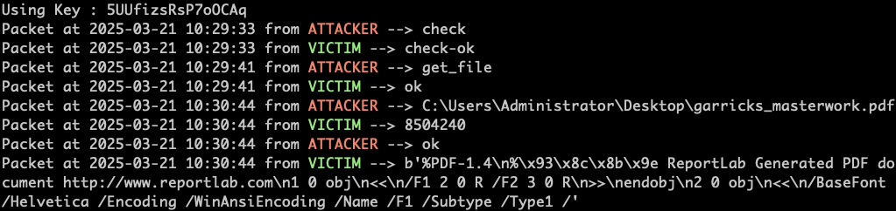

# 🕵️ Forensics Challenge

## 🏷️ Name: ToolPie

## 🔥 Difficulty: Medium

## 📜 Challenge Description: 
> In the bustling town of Eastmarsh, Garrick Stoneforge’s workshop site once stood as a pinnacle of enchanted lock and toolmaking. But dark whispers now speak of a breach by a clandestine faction, hinting that Garrick’s prized designs may have been stolen. Scattered digital remnants cling to the compromised site, awaiting those who dare unravel them. Unmask these cunning adversaries threatening the peace of Eldoria. Investigate the incident, gather evidence, and expose Malakar as the mastermind behind this attack.

--- 
## 📂 Provided Files:
- **Filename:** `capture.pcap`

--- 

# 🚀 Methodology

### 🔎 1️⃣ Understanding the Evidence

Looking at general things in the Pcap, we can see that it's entirely composed of TCP:


If we follow the TCP stream, we'll find various malicious files.

In TCP Stream 3, theres an HTTP Post for a script:


It's also the only POST.

I always like to export all the HTTP files using --> File --> Export Objects --> HTTP and inspect them manually.


We have the answers to the first two tasks:

--- 

#### 📋 Task 1: What is the IP address responsible for compromising the website?

**✅ Answer:** `194.59.6.66`  

#### 📋 Task 2: What is the name of the endpoint exploited by the attacker?

**✅ Answer:** `execute`

--- 


## 🦠 2️⃣ The Payload

We can load the json file in python and check it out:

```python
import json

with open('http/execute','r') as inf:
    payload = json.loads(inf.read())

```

the payload starts with:

`import marshal,lzma,gzip,bz2,binascii,zlib;exec(marshal.loads(bz2.decompress(b'(...)`

So I'm only going to extract the bytes part so that it doesn't execute:

```python
import ast
import bz2
import marshal
import dis

script = payload['script']
start = script.find("b'")
end = script[start:].find("')") + start +1

byte_code = ast.literal_eval(script[start:end])
decompressed = bz2.decompress(byte_code)
code_object = marshal.loads(decompressed)
print("Co Consts\n")
print(code_object.co_consts)
print('\n\n')
print("Disassembly")
print(dis.dis(code_object))

```

The name of the program is `Py-Fuscate`, which is [described](https://github.com/Sl-Sanda-Ru/Py-Fuscate) as:

>"A Program Which Allows You To Obfuscate Python Programs"

This gives us the answer to **Task 3**:

--- 

#### 📋 Task 3: What is the name of the obfuscation tool used by the attacker?

**✅ Answer:** `Py-Fuscate`


---


This specific program shows clearly that it uses **AES CBC**:


I dumped the code to a `.pyc` file and uploaded it to [PyLingual](https://pylingual.io).


```python
import importlib

pyc_data = importlib._bootstrap_external._code_to_timestamp_pyc(code_object)
with open(f'decompressed.pyc', 'wb') as f:
    f.write(pyc_data)

```

#### The Encryption/Decryption Functions:


And we can see that both client/server send eachother the keys. Chat GPT gave me a better/more clean version. 


--- 

#### 📋 Task 4:What is the IP address and port used by the malware to establish a connection with the Command and Control (C2) server?

**✅ Answer:** `13.61.7.218:55155`

--- 


Based on the reconstructed code, the keys must be in the traffic!


The separator is simply `<SEPARATOR>`.

I wrote a [script]('pcap_display.py') to parse the pcap and print the data. 



---

#### 📋 Task 5: What encryption key did the attacker use to secure the data?

**✅ Answer:** `5UUfizsRsP7oOCAq`


---

And from the output, we see that the **exfiltrated** file is `garricks_masterwork.pdf`.


#### 📋 Task 6: What is the MD5 hash of the file exfiltrated by the attacker?

```bash
md5sum  garricks_masterwork.pdf
```

**✅ Answer:** `8fde053c8e79cf7e03599d559f90b321`

